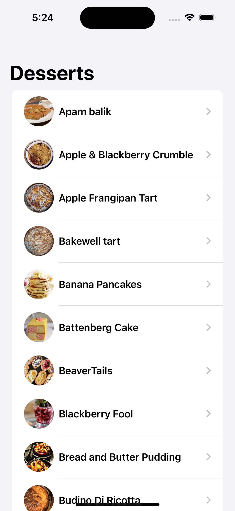
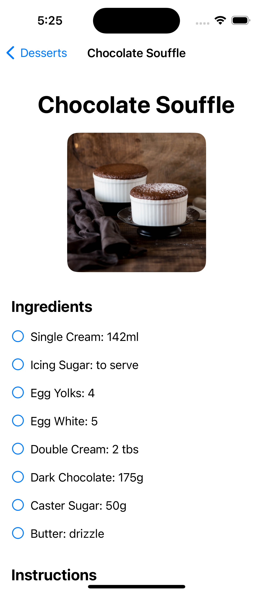
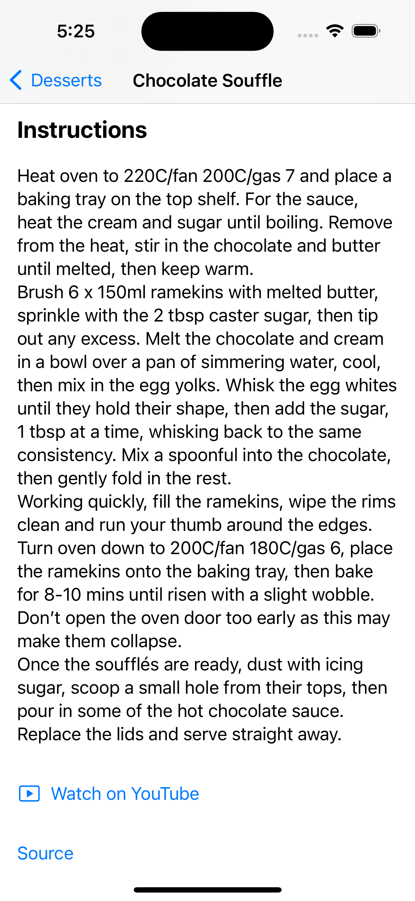

## Name       : NagaSrivatsav Machiraju
## Email      : mnagasrivatsav@gmail.com
## Github URL : https://github.com/nmachira/Recipe-App/tree/main

## Screenshots:

    
    
    

# Recipe Browser App Documentation

## Models

### Meal

The `Meal` struct represents a simple meal in the dessert category. It conforms to the `Identifiable` and `Codable` protocols.

- **Properties:**
  - `id`: The unique identifier for the meal.
  - `name`: The name of the meal.
  - `thumbnail`: The URL for the meal's thumbnail image.

### MealDetails

The `MealDetails` struct represents detailed information about a meal, including ingredients, instructions, and multimedia links. It conforms to the `Codable` protocol.

- **Properties:**
  - `id`: The unique identifier for the meal.
  - `name`: The name of the meal.
  - `instructions`: Instructions for preparing the meal.
  - `ingredients`: A dictionary of ingredients and their measurements.
  - `youtubeURL`: An optional URL to a YouTube video related to the meal.
  - `imageSource`: An optional URL to the meal's image.
  - `linkSource`: An optional URL to the source of the meal recipe.

---

## Network Manager

The `NetworkManager` class is responsible for managing network requests to the MealDB API.

- **Methods:**
  - `fetchDesserts()`: Fetches a list of dessert meals.
  - `fetchMealDetails(id: String)`: Fetches detailed information about a specific meal by its ID.

- **Base URL:**
  - `https://themealdb.com/api/json/v1/1`

## Views

### ContentView

The `ContentView` is the main view displaying a list of dessert meals.

- **State Variables:**
  - `meals`: An array of `Meal` objects.
  - `isLoading`: A boolean indicating whether the data is being loaded.

- **Body:**
  - The view displays a `ProgressView` while loading data.
  - A `List` of meals is displayed once the data is loaded.
  - Each meal item in the list is a `NavigationLink` that navigates to the `MealDetailView`.

### MealDetailView

The `MealDetailView` displays detailed information about a specific meal.

- **State Variables:**
  - `mealID`: The ID of the selected meal.
  - `mealDetails`: An optional `MealDetails` object.
  - `isLoading`: A boolean indicating whether the data is being loaded.
  - `ingredientChecks`: A dictionary to manage checkbox states for ingredients.

- **Body:**
  - The view displays a `ProgressView` while loading data.
  - Detailed information about the meal, including the name, image, ingredients, and instructions, is displayed once the data is loaded.
  - Ingredients are displayed as checkboxes.
  - Links to YouTube videos and the source of the recipe are provided if available.
  - The navigation title is set to the meal name and is centered.

## Additional Features

- **Images in Detail View:** Added images in the meal detail view for better visual representation.
- **YouTube Links:** Added YouTube links to watch related videos.
- **Source Links:** Added source links at the bottom of the detail view for referencing the original recipe.
